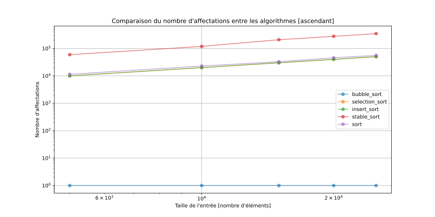

# L1 - Complexité - Groupe n°1

## Introduction

Ce rapport présente l'analyse des résultats obtenus pour la comparaison de trois 
algorithmes de tri simples et deux algorithmes de la STL :

* Tri à bulles
* Tri par sélection
* Tri par insertion
* std::sort
* std::stable_sort

Afin de comparer ces algorithmes, deux indicateurs ont été utilisés : le nombre d'opérations (affectations et
comparaisons) et le temps d'exécution de l'algorithme.

Nous avons effectué plusieurs mesures pour chaque algorithme en modifiant à chaque fois le nombre d'entrées du tableau
ainsi que la disposition initiale des données :

* Ordonnée (ascendant)
* Ordonnée inverse (descendant)
* Aléatoire
* Presque ordonnée

Les tailles des séquences sont les suivantes : 5 000, 10 000, 15 000, 20 000, 25 000.

Pour générer nos séquences aléatoires nous avons utilisé la graine suivante : `1337` et le générateur
pseudo-aléatoire `std::default_random_engine`. Concernant la génération presque ordonnée, nous avons appliqué la
pondération suivante : 90% trié et 10% non-trié.

Finalement, concernant les mesures des temps d'exécution des algorithmes nous avons mesuré 5 fois ceux-ci sur le même
set de données et avons établi une moyenne.

Les mesures ont été effectuées sous un ordinateur Ubuntu 22.04 x64 avec un programme compilé sous gcc 11.2.0 et ayant
comme processeur un i7 1165G7.

#### Nota Bene :

- Graphiques générés à l'aide de [plot.py](plot.py) à partir des CSV.

- Attention, les graphes représentés ci-dessous sont à l'échelle logarithmique.
Certaines droites sont confondues, mais elles sont toutes représentées.

- Le nombre d'affectations et de comparaisons a été calculé grâce à la classe 
  [op_counter.h](../src/op_counter.h) en surchargeant les opérateurs de 
  comparaison et d'affectation ou constructeur. Toutes les affectations et 
  comparaisons même pour des objets créés temporairement seront prises en compte.

## Nombre de comparaisons

| Données brutes (format CSV)                                        |
|--------------------------------------------------------------------|
| [Comparaisons bubble_sort](csv/bubble_sort_affectations.csv)       |
| [Comparaisons insert_sort](csv/insert_sort_affectations.csv)       |
| [Comparaisons selection_sort](csv/selection_sort_affectations.csv) |
| [Comparaisons std::sort](csv/sort_affectations.csv)                |
| [Comparaisons std::stable_sort](csv/stable_sort_affectations.csv)  |

## Observations

On peut remarquer qu'en termes du nombre de comparaisons, les tris par insertion 
et par sélection sont ceux qui sont les plus gourmands, quelle que soit 
l'organisation des données en entrée. Particulièrement le tri par sélection.

Pour ce qui est des autres algorithmes, la différence entre l'organisation des 
données n'est pas non plus des plus flagrante, autour des 10 comparaisons par 
élément du tableau pour environ tout type de données d'entrée.

Les algorithmes de la STL restent les plus efficaces sur un tableau non-ordonné.

### Tableau résumé de la complexité des comparaisons

| **Tri**          | **Ascendant** | **Partiellement ordonné** | **Non-ordonné** | **Descendant** |
|------------------|---------------|---------------------------|-----------------|----------------|
| À bulles         | O(n)          | O(n^2)                    | O(n^2)          | O(n^2)         |
| Insertion        | O(n)          | O(n^2)                    | O(n^2)          | O(n^2)         |
| Sélection        | O(n^2)        | O(n^2)                    | O(n^2)          | O(n^2)         |
| std::sort        | O(n * log(n)) | O(n * log(n))             | O(n * log(n))   | O(n * log(n))  |
| std::stable_sort | O(n * log(n)) | O(n * log(n))             | O(n * log(n))   | O(n * log(n))  |

Ce tableau a été déduit des données brutes CSV et des graphes obtenus. 
Nous avons confirmé ces complexités grâces aux cours d'ASD sur les tris et aux cours de PRG1.

## Nombre d'affectations

| Données brutes (format CSV)                                        |
|--------------------------------------------------------------------|
| [Affectations bubble_sort](csv/bubble_sort_affectations.csv)       |
| [Affectations insert_sort](csv/insert_sort_affectations.csv)       |
| [Affectations selection_sort](csv/selection_sort_affectations.csv) |
| [Affectations std::sort](csv/sort_affectations.csv)                |
| [Affectations std::stable_sort](csv/stable_sort_affectations.csv)  |

## Observations

On peut remarquer que pour la plupart des organisations des données, les tris par
insertion et à bulles sont ceux qui sont le plus demandant en termes
d'affectations. Mis à part pour la disposition ordonnée où le tri à bulle ne
requiert aucune affectation.

Les trois autres tris étant en général bien moins coûteux en termes
d'affectations, on les retrouve assez proches les uns des autres en bas des
graphes. Le tri par sélection étant pratiquement à chaque fois le moins couteux
peu importe la disposition des entrées choisie. En revanche, il effectue bien plus 
de comparaisons que les autres comme décrit précédemment.

Les algorithmes de la STL restent les plus efficaces sur un tableau non-ordonné.

### Tableau résumé des affectations

| **Tri**          | **Ascendant** | **Partiellement ordonné** | **Non-ordonné** | **Descendant** |
|------------------|---------------|---------------------------|-----------------|----------------|
| À bulles         | O(1)          | O(n^2)                    | O(n^2)          | O(n^2)         |
| Insertion        | O(n)          | O(n^2)                    | O(n^2)          | O(n^2)         |
| Sélection        | O(n)          | O(n)                      | O(n)            | O(n)           |
| std::sort        | O(n)          | O(n * log(n))             | O(n * log(n))   | O(n)           |
| std::stable_sort | O(n * log(n)) | O(n * log(n))             | O(n * log(n))   | O(n * log(n))  |

# Temps d'exécution

| Données brutes (format CSV)                         |
|-----------------------------------------------------|
| [Temps bubble_sort](csv/time_bubble_sort.csv)       |
| [Temps insert_sort](csv/time_insert_sort.csv)       |
| [Temps selection_sort](csv/time_selection_sort.csv) |
| [Temps std::sort](csv/time_sort.csv)                |
| [Temps std::stable_sort](csv/time_stable_sort.csv)  |

## Comparaisons entre les algorithmes selon le type d'entrée

## Temps d'exécution observés selon le type d'entrée pour un algorithme

## Observations

On remarque que de manière générale les tris proposés par la STL sont plus 
rapides que ceux que nous avons développés, hormis pour le tri à bulles et le 
tri par insertion qui eux sont plus rapides lorsque l'entrée est déjà triée. 
Cette différence s'explique par la complexité des comparaisons en O(n) pour les 
deux algorithmes et les complexités des affectations en O(1) et O(n) pour le tri 
à bulles et le tri par insertion respectivement. Plus précisément, ils effectuent 
moins d'opérations d'affectations et de comparaisons que les autres tris.

Concernant le tri par sélection, comme on l'a déjà vu avec le nombre d'opérations,
le temps d'exécution reste inchangé peu importe le type de données en entrée.

En guise de conclusion, voici un petit récapitulatif des avantages/désavantages 
de chaque algorithme :

| **Tri**          | **+**                                                                   | **-**                             |
|------------------|-------------------------------------------------------------------------|-----------------------------------|
| À bulles         | Temps, comparaisons, affectations (ascendant)                           | Temps, comparaisons, affectations |
| Insertion        | Temps, comparaisons (ascendant)                                         | Temps, comparaisons, affectations |
| Sélection        | Affectations (globalement), constant pour toute taille et type d'entrée | Temps, comparaisons               |
| std::sort        | Très efficace sur tous types de données                                 | -                                 |
| std::stable_sort | Très efficace sur tous types de données                                 | -                                 |
