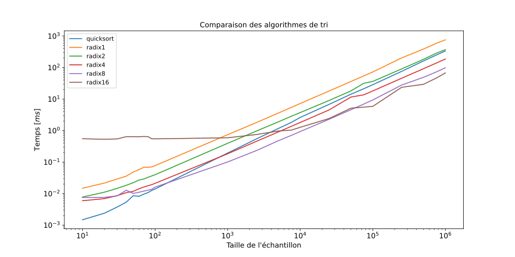

# L3 - Tris

Ce court rapport présente les différents résultats obtenus lors des mesures des algorithmes de tri.

Les mesures ont été effectués avec la configuration suivante :
* OS: Ubuntu x64 22.04 :
* CPU: Intel Core i7-1165G7 @ 2.80GHz
* Compilateur: GCC 11.2.0

Détails des algorithmes :
* Tri rapide (quick_sort)
  * Choix du pivot : aléatoire
  * Semi-récursif
* Tri par base (radix_sort)
  * Plusieurs bases : 16 bits, 8 bits, 4 bits, 2 bits, 1 bit
* Graine utilisée : `0xdeadbeef`

Tous les tris ont été effectués sur des tableaux de taille de 10 à 1 000 000 éléments.
Les éléments sont de types `unsigned int` (32 bits).

Précisément voici la liste des tailles d'échantillons :

[10, 20, 30, 40, 50, 60, 70, 80, 90, 100, 1'000, 2'500, 5'000, 7'500, 10'000, 25'000,
50'000, 75'000, 100'000, 250'000, 500'000, 750'000, 1'000'000]

## Analyse des résultats

[Mesures en format CSV](csv/results.csv)

 
En fonction de la taille de l'entrée (échantillons) il est préférable de :

| Taille de l'entrée [n] | Algorithme optimal (temps d'exécution) |
|------------------------|----------------------------------------|
| 10 < n < 100           | tri rapide                             |
| 100 < n < 75'000       | tri par base de 8 bits                 |
| 75'000 < n < 1'000'000 | tri par base de 16 bits                |

Comme vu dans le cours, le tri par base est plus efficace (pour de grandes valeurs de n) que le tri rapide mais 
en revanche il n'est pas en place en terme de mémoire. Le tri rapide quant à lui est constant en terme de temps d'exécution et est en place en mémoire, i.e., pas de tableaux temporaires créés durant l'exécution de l'algorithme.

Au vu de la tendance des courbes, il ne sert à rien de comparer les algorithmes au-delà d'un million d'éléments. Celles-ci semblent rester constantes.

## Détails

Les vérifications des fonctions `counting_sort`, `radix_sort`, `quick_sort` et 
`partition` ont été implémentées sur des tableaux de unsigned int dans [check_sort.
hpp](../src/check_sort.hpp).

Les algorithmes `radix_sort` et `quick_sort` ont été vérifiés en les appliquant 
sur un tableau non-trié en vérifiant qu'il soit trié après coup.

L'algorithme `partition` a été testé en vérifiant que tous les éléments à gauche 
du pivot soient <= et que tous les éléments à droite soient >=.

Quant à `counting_sort`, il a été appliqué sur une base de 8 bits. La 
vérification a été faite en testant que les 8 premiers bits de 
chaque élément du tableau soit trié.